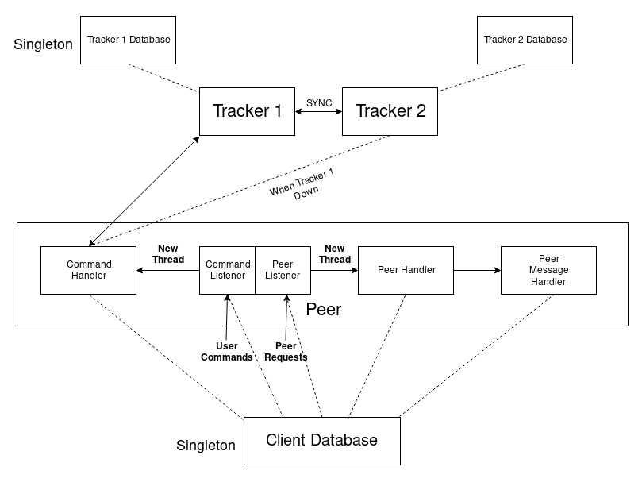
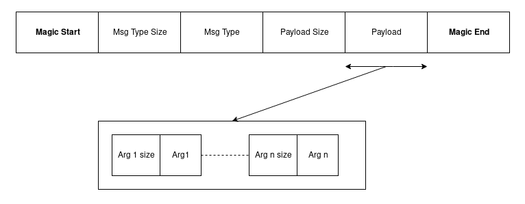

# Mini-Torrent
- Built a file sharing system with multi-tracker functionality. 
- It provides support for fault tolerance and parallel downloading. 
- Technologies used: C++, Pthread.
- 

## Parallel Download algorithm:
1. Create a 2-D map of chunk index - list of peers having that chunk of the file
2. For each chunk index i:
    - Generate a random number x of range (0, len(peer_list_of_chunk))
    - Download chunk i from the peer present at index x

### Message Format

1. Magic start: Indicates the start of a new message
2. Msg Type size: Size(in bytes) of the message type, ie, number of bytes to read to get the message type
3. Msg type: Actual message type(ex: share, etc)
4. Payload size: Size(in bytes) of the entire payload, ie, number of bytes to read to get entire payload
5. Payload: Payload in bytes
6. Magic end: Indicates the end of the message
7. Payload can constitute of a number of arguments, each appened by the arg size(in bytes) to indicate the number of bytes to read to retrive the argument

#### Tracker
1. fileAttr - Creates an object to store all data related to a single file(ex: hash, seeder list, etc)
2. rpcHandler - Handler to handle all the different client requests
3. trackerMessageHandler - Message specific Handler to handle different requests
4. trackerDatabase - Singleton class to store all data required by the tracker

## User Commands
1. share <local file path> <filename>.mtorrent : Shares file availability to the network
2. get <path to .mtorrent> <destination path> : Downloads the file to the destination path
3. show downloads: shows the ongoing/completed file downloads
4. remove <filename.mtorrent>: remove sharing of the file by the current user
5. quit: exits application
